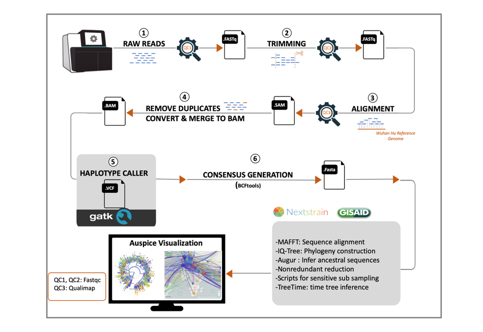

#Genomic Epidemiology in UAE

These scripts where used to run SARS-Cov2 transmission analysis based on full genomes from 
local samples as well 

## Summary
Global and local whole genome sequencing efforts of SARS-Cov-2 enable the tracing of domestic and international transmissions. We sequenced viral RNA from 37 randomly sampled Covid-19 patients with PCR-confirmed infection in different regions of the UAE and developed time resolved phylogenies with 69 local and 3,858 global genome sequences.  
We  determine UAE specific clades, their global diversity, introduction events and deduct domestic, regional and international virus transmissions between January and June 2020.  We observe a steep and sustained decline of international transmissions immediately after the introduction of international travel restrictions. For the identified regional transmissions across Emirates, the estimated arrival of the most recent common ancestors predate regional travel bans. Finally, we observe a prevalence shift for the D614G mutation over time, owing to later non-Asian G-variant introductions.  In summary, we comprehensively characterized the genomic aspects of the epidemic spread in the UAE.  

## Variant calling
We construct a pipeline around the best practice recommendations for GATK.
The scripts 

## Phylogeny construction
### Redundance Reduction
We  reduce redundancy by retaining only single representatives per country, 
yielding 17,044 sequences (script nr.py). 
The script calculates SHA fingerprints that are faster to compare than entire genomes.
This works well for exact identity only (which is what we need).